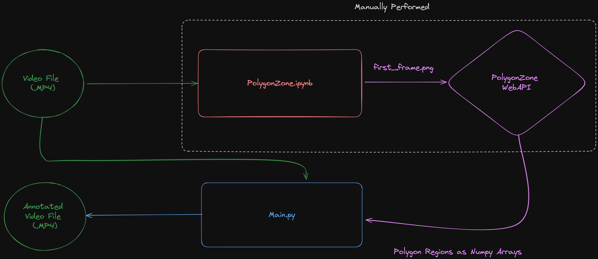

# Traffic Detection with Supervision

## Introduction

A fun project for detecting and analyzing traffic flow from video using Roboflow's Supervision package and Ultralytics' implementation of YOLOv8.

Primary goal of this project is to be able to count vehicles passing a user defined threshold and determine number of lane changes. 

## Project Description

## Future Work

Here are some possible avenues for improving this project, either for better performance or functionality.

### Performance

- We can fine-tune the yolov8 model with a custom dataset that matches how the vehicles are seen in the camera feed. 

### Functionality

## References

- This project leans heavily on the great tutorials and Supervision package provided by [Roboflow](https://roboflow.com/)
- Website Icon Attribution: https://www.flaticon.com/free-icon/truck_819873?term=truck&page=1&position=5&origin=search&related_id=819873
